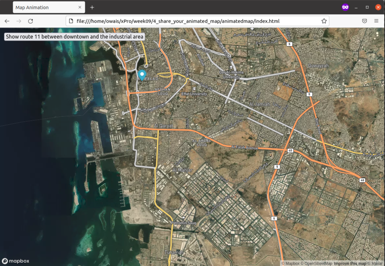

# BusTracking
Real Time Bus Tracking Repository for xPro course

Description: This is an exercise in learning how to display animated map markers using the Mapbox API. When run, markers appear one at a time and show route 11 of the Saudi Public Transport Company (SAPTCO) between downtown and the industrial area of Jeddah, Saudi Arabia. The appearance of each marker is supposed to show the movement of the bus, and does not necessarily represent a stop along the route.

Usage: This program requires a valid Mapbox access token. Copy/download the files in the BusTracking folder and edit line 2 of mapanimation.js with your access token. Then open index.html in a web browser and click the button at the top left of the screen. You should see something like the following:
 

Roadmap: This exercise can be improved in the future by adding a feature where the map marker animation will stop at the location of each bus stop, show a pop-up description with the location, and then close and continue. More map markers can be added to better show movement since the bus travels a long distance over several roads.

License: MIT License (NOTE: significant parts of this code was taught and/or provided via the MIT xPRO course in Full Stack Development, and I do not claim ownership over it)

Permission is hereby granted, free of charge, to any person obtaining a copy
of this software and associated documentation files (the "Software"), to deal
in the Software without restriction, including without limitation the rights
to use, copy, modify, merge, publish, distribute, sublicense, and/or sell
copies of the Software, and to permit persons to whom the Software is
furnished to do so, subject to the following conditions:

The above copyright notice and this permission notice shall be included in all
copies or substantial portions of the Software.

THE SOFTWARE IS PROVIDED "AS IS", WITHOUT WARRANTY OF ANY KIND, EXPRESS OR
IMPLIED, INCLUDING BUT NOT LIMITED TO THE WARRANTIES OF MERCHANTABILITY,
FITNESS FOR A PARTICULAR PURPOSE AND NONINFRINGEMENT. IN NO EVENT SHALL THE
AUTHORS OR COPYRIGHT HOLDERS BE LIABLE FOR ANY CLAIM, DAMAGES OR OTHER
LIABILITY, WHETHER IN AN ACTION OF CONTRACT, TORT OR OTHERWISE, ARISING FROM,
OUT OF OR IN CONNECTION WITH THE SOFTWARE OR THE USE OR OTHER DEALINGS IN THE
SOFTWARE.
